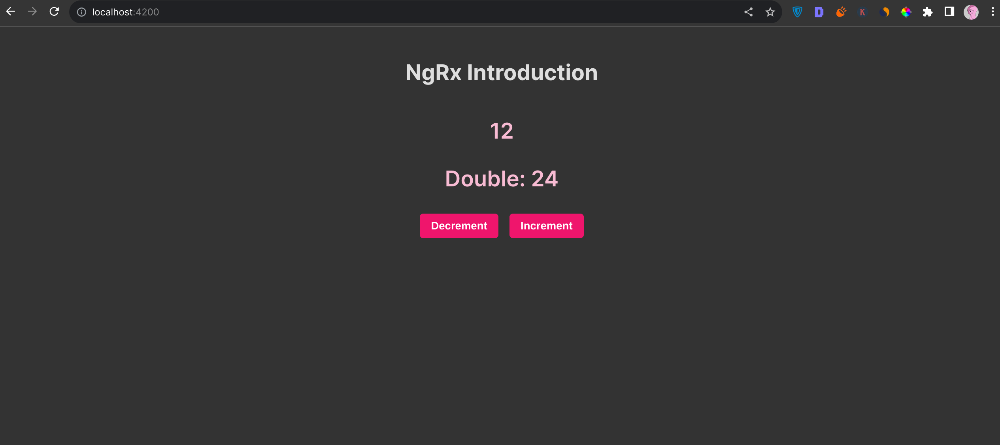

# Counter - A simple counter app.

## Welcome! 👋
This is a simple counter application that I used to get my hands on NgRx. I learnt about using NgRx for state management. Overall, I learnt how to create actions and attach data to actions, reducers, selectors, and Effects.

## How To Run? 🤔
Download this code either as a `zip file` or use the `git clone` command to clone it.
Then, open the project folder in your editor and on the integrated terminal:
-  Run `npm install` to install all the packages used for this project.
After the installation,
- Run `ng serve` to run the project on your browser localhost.
    That's all you'd need to do 🙂
